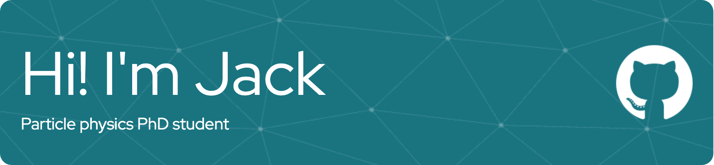

 

I'm a PhD student researching particle physics.

**About me**

- 💼 High energy particle physics PhD student at The University of Sheffield

- 💦 Research focused on the detection of neutrinos using water Cherenkov detectors: Hyper-Kamiokande and Super-Kamiokande

- 🧐 Currently developing a diffuse supernova neutrino background analysis for Hyper-Kamiokande

- 💬 Ask me about anything [here](https://github.com/jackfannon/jackfannon/issues)

<code></code>
<code></code>
<code></code>

|  |  |
| ------------- | ------------- |

<!--
**JackFannon/JackFannon** is a ✨ _special_ ✨ repository because its `README.md` (this file) appears on your GitHub profile.

Here are some ideas to get you started:

- 🔭 I’m currently working on ...
- 🌱 I’m currently learning ...
- 👯 I’m looking to collaborate on ...
- 🤔 I’m looking for help with ...
- 💬 Ask me about ...
- 📫 How to reach me: ...
- 😄 Pronouns: ...
- ⚡ Fun fact: ...
-->
